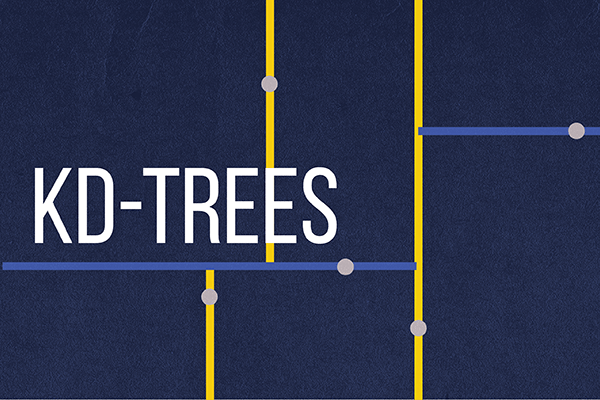

# princeton-algorithms

My solutions to the Princeton Algorithms Courses: [Algorithms, Part I](https://www.coursera.org/learn/algorithms-part1) and [Algorithms, Part II](https://www.coursera.org/learn/algorithms-part2) programming assignments on Coursera.

## Projects

|                   Project                   |           Code            |                                             Specification                                             |
|:-------------------------------------------:|:-------------------------:|:-----------------------------------------------------------------------------------------------------:|
|       | [Code 💻](./percolation/) | [Specification 📖](https://coursera.cs.princeton.edu/algs4/assignments/percolation/specification.php) |
|  |   [Code 💻](./queues/)    |   [Specification 📖](https://coursera.cs.princeton.edu/algs4/assignments/queues/specification.php)    |
|           ***Collinear Points***            |  [Code 💻](./collinear/)  |  [Specification 📖](https://coursera.cs.princeton.edu/algs4/assignments/collinear/specification.php)  |
|              |   [Code 💻](./8puzzle/)   |   [Specification 📖](https://coursera.cs.princeton.edu/algs4/assignments/8puzzle/specification.php)   |
|               |   [Code 💻](./kdtree/)    |   [Specification 📖](https://coursera.cs.princeton.edu/algs4/assignments/kdtree/specification.php)    |
|               |   [Code 💻](./wordnet/)   |   [Specification 📖](https://coursera.cs.princeton.edu/algs4/assignments/wordnet/specification.php)   |
|             |    [Code 💻](./seam/)     |    [Specification 📖](https://coursera.cs.princeton.edu/algs4/assignments/seam/specification.php)     |

## Useful Resources

Here are some relevant resources that one might find useful.

- Environment Setup ([Mac](https://lift.cs.princeton.edu/java/mac/index.php), [Windows](https://lift.cs.princeton.edu/java/windows/), [Linux](https://lift.cs.princeton.edu/java/linux/)): a tutorial on how to set up the development environment locally.
- [Booksite](https://algs4.cs.princeton.edu/): the booksite for *Algorithms, 4th Edition* (Sedgewick and Wayne, 2011).
- [Code Repositories](https://algs4.cs.princeton.edu/code/): the Java source codes in the lectures and in the book.
- [`edu.princeton.cs.algs4` Javadoc](https://algs4.cs.princeton.edu/code/javadoc/): the Javadoc for the `edu.princeton.cs.algs4` package.
